# Fantasy Football
 Fantasy football website for Imperial RSM football team. This Website uses:
- React JS frontend
- FastAPI backend
- SQL relational database for users, teams, players and game attribute storage
- AWS S3 to store player pictures and database backups

 ## Login Page
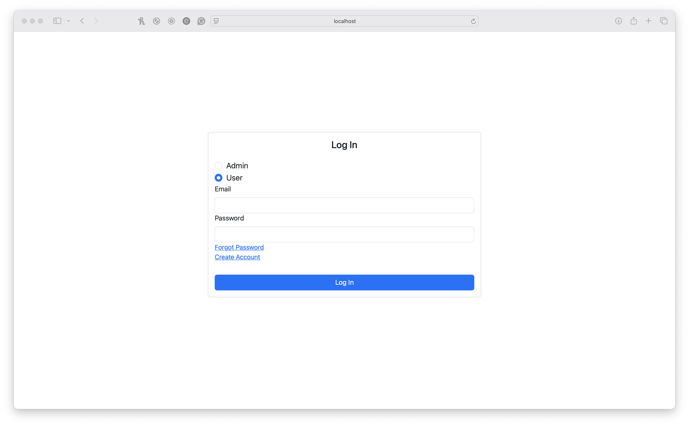

 ## Forgot Password 
Page to reset password - temp passweord sent to email address
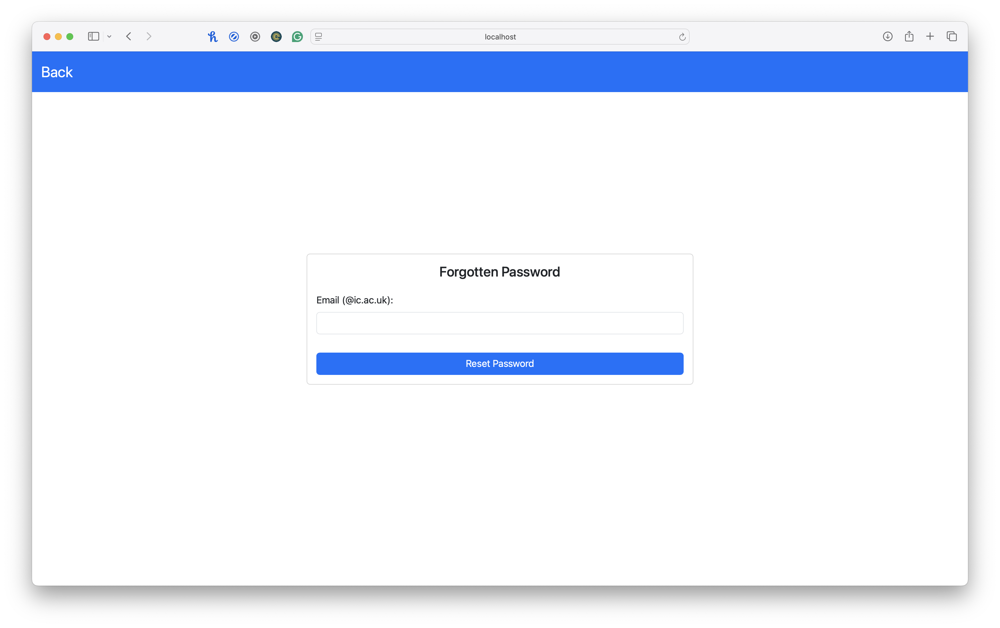

 ## Create User
Page to create a new user - imperial email required, temp password sent to email
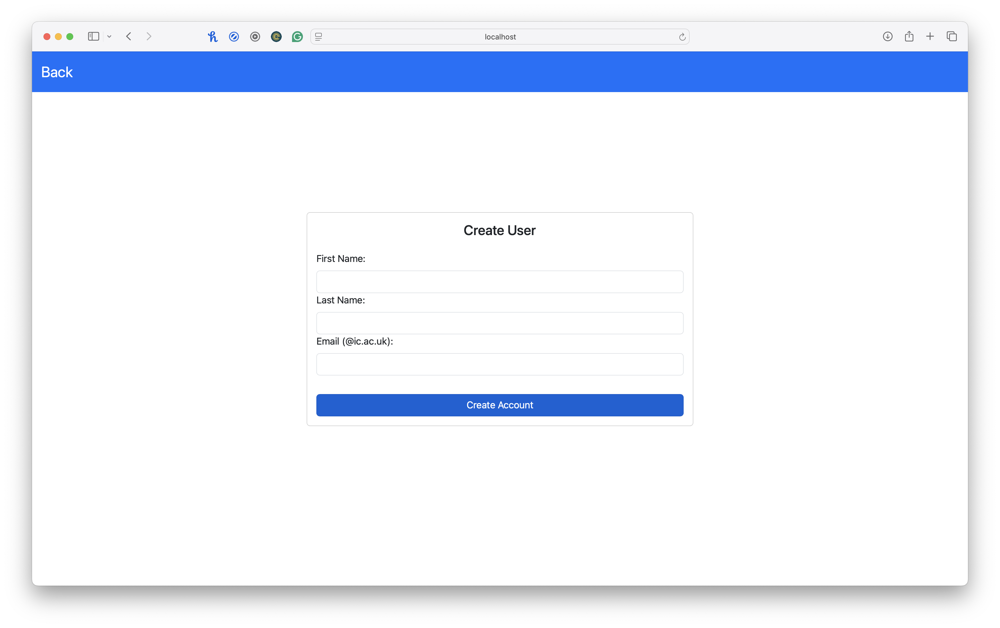

 ## Admin Home
 Admin Home page showing players in the RSM Fantasy league
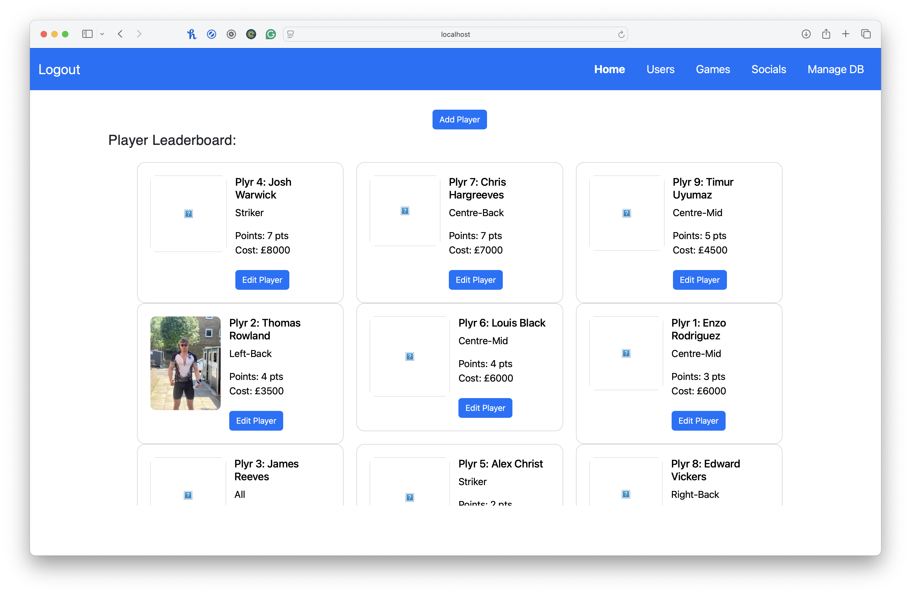

 ## Admin Edit Players
 Ability to change price, no. points, position & player picture
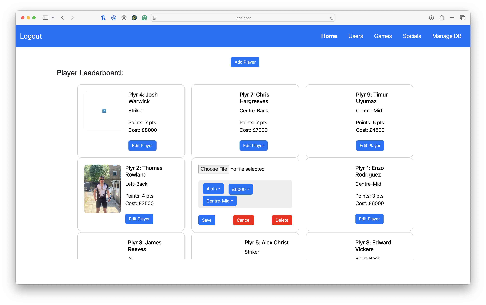

 ## Admin Users
 Admin Users page shows list of fantasy users
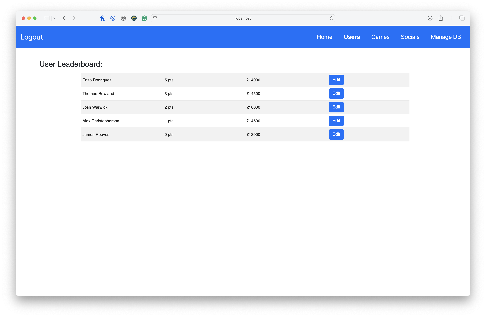

 ## Admin Edit Users
 Ability to change points and balance
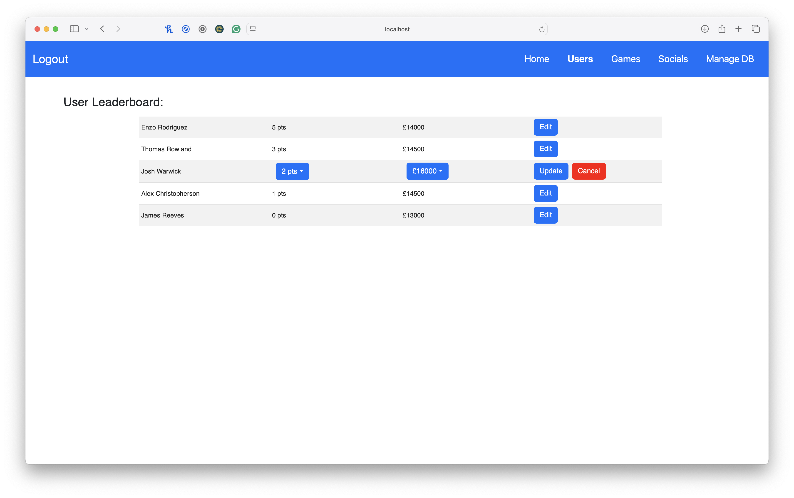

 ## Admin Games
 Admin Games page shows RSM football games
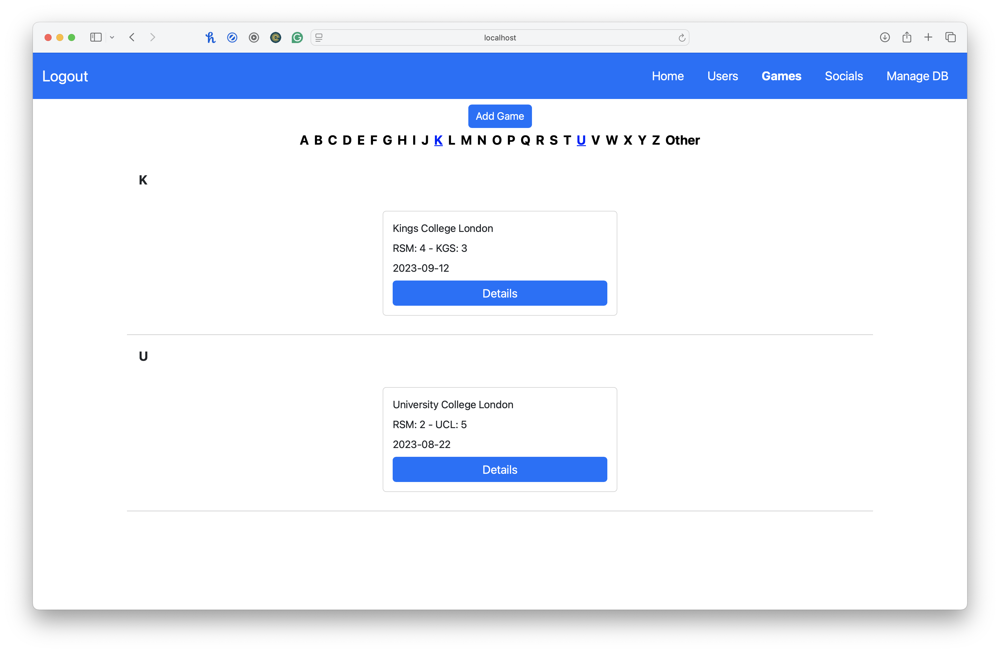

 ## Admin Game Details
 Ability to review details of game
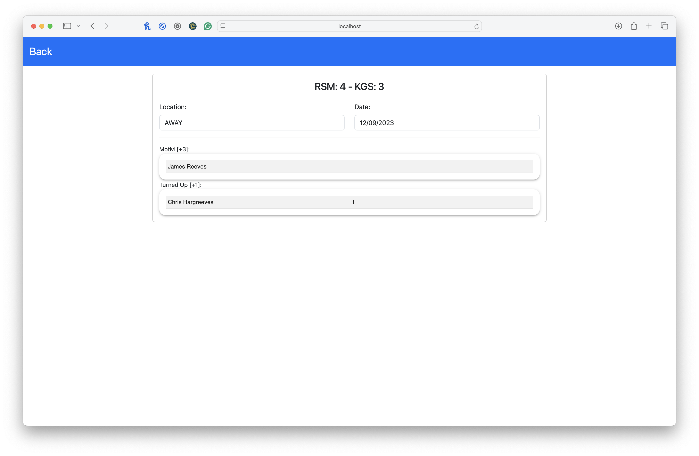

 ## Admin Add Game
 Admin add game page
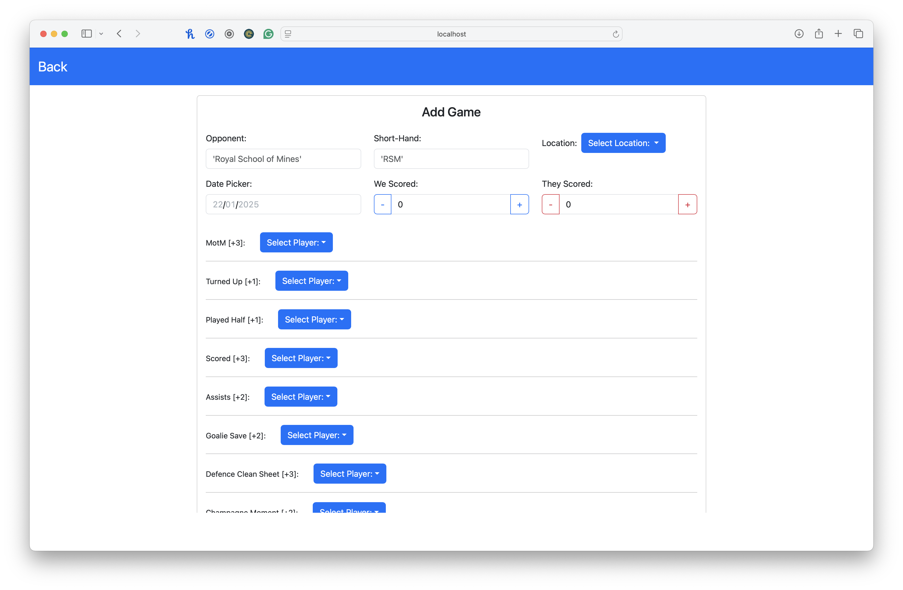

 ## Admin Backups
 Overview of backups of database with ability to restore, delete backups
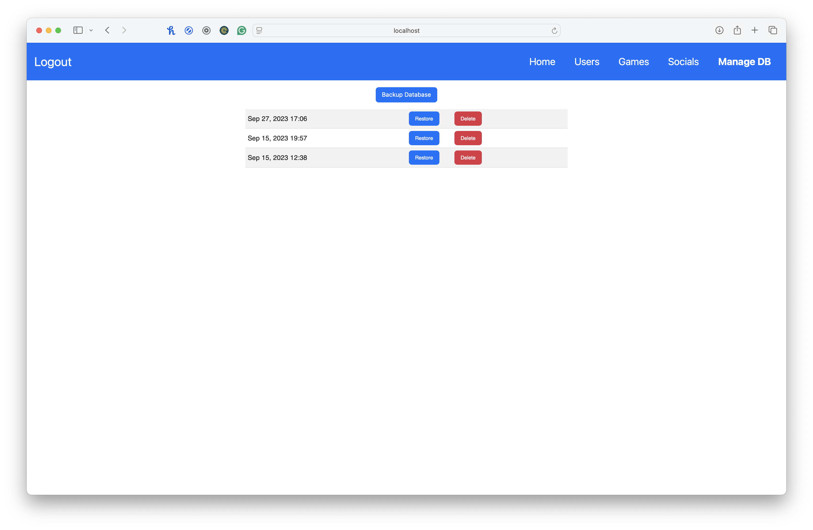

 ## User Home
 Users home page showing users leaderboard and your team selection
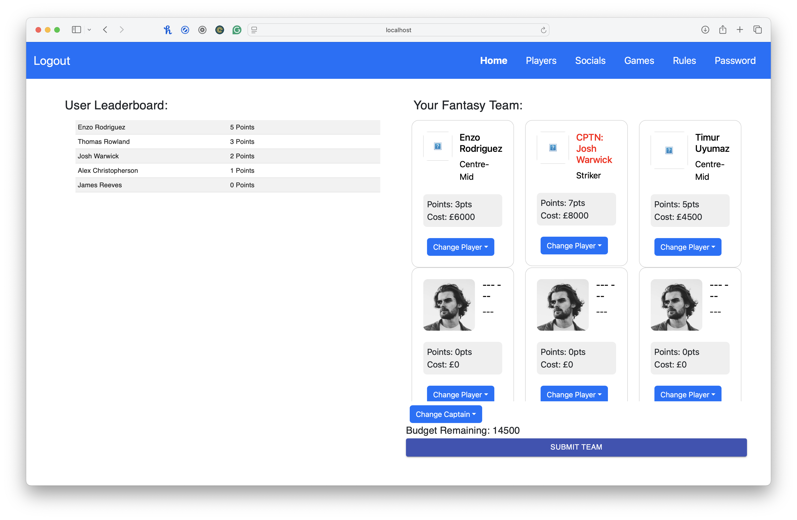

 ## User Players
 Users player page allows browsing of players
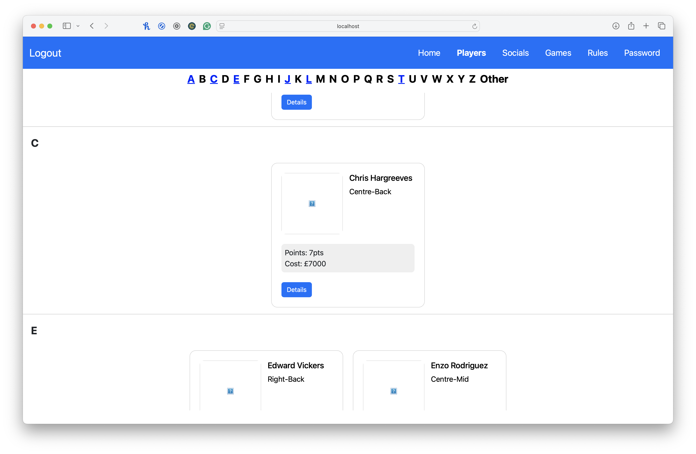

 ## User Change Password
 Users change password page
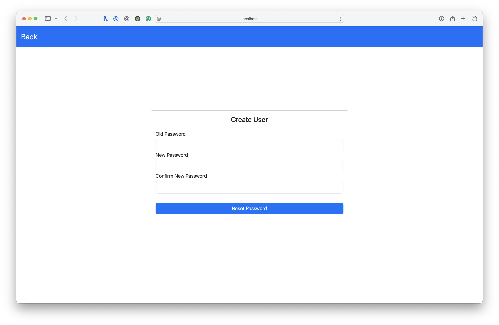

